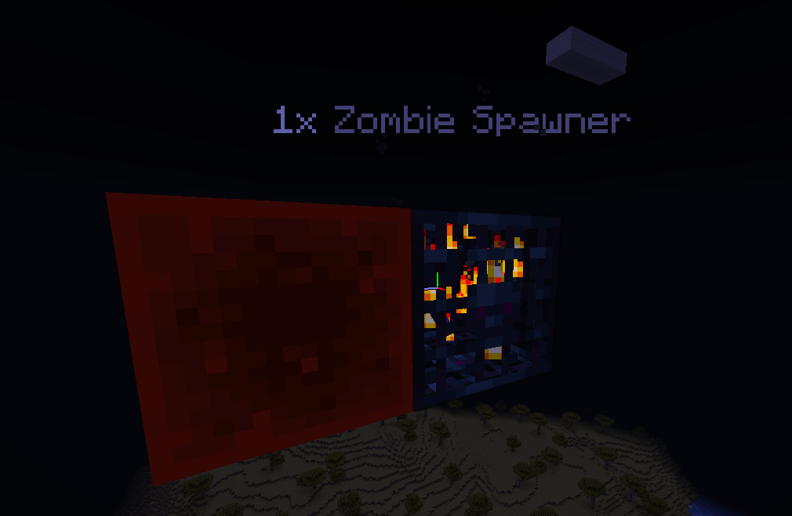

A custom spawner is an ordinary spawner block carrying EcoMobs settings. It can spawn an EcoMob or a plain vanilla entity, and every setting a vanilla spawner has — delay, count, radius, player range — is editable per spawner, alongside EcoMobs extras like pickup rules, explosion immunity, and particle animations.

The settings ride on the item, so a spawner picked up and placed somewhere else keeps everything it was given.

## Getting a spawner

```
/ecomobs spawner give <player> <mob> [amount] [attributes...]
```

`<mob>` is an EcoMob ID or a vanilla entity type, so `/ecomobs spawner give Notch hollow_king` and `/ecomobs spawner give Notch zombie` both work.

Attributes can be set as you hand it out:

```
/ecomobs spawner give Notch voidling 3 delay 100 200 count 6 explosion-proof true
```

To change one later, hold the spawner item — or look at a placed spawner within 5 blocks — and run:

```
/ecomobs spawner modify <attribute> [value...]
```

Each attribute is gated by its own permission, `ecomobs.command.spawner.modify.<attribute>`, on both commands.

### Attributes

| Attribute | Value(s) | Default | What it does |
| --- | --- | --- | --- |
| `mob` | `<mobId>` | — | The EcoMob ID or vanilla entity type the spawner spawns |
| `delay` | `<min> <max>` | `200 800` | The tick range between spawn cycles, rolled fresh each cycle |
| `radius` | `<blocks>` | `4` | How far from the spawner mobs appear |
| `player-radius` | `<blocks>` | `16` | How close a player has to be for the spawner to run at all |
| `count` | `<number>` | `4` | Mobs spawned per cycle |
| `max-nearby` | `<number>` | `6` | Mobs of that kind nearby before the spawner holds off |
| `pickup` | `allow` \| `silk_touch` \| `deny` | `deny` | Whether breaking it gives the spawner back |
| `particle` | `none` \| `<animation>` | `none` | The particle animation drawn above it |
| `explosion-proof` | `true` \| `false` | `false` | Whether it survives creepers and TNT |
| `no-ai` | `true` \| `false` | `false` | Whether spawned mobs have their AI taken away — see [No AI](#no-ai) |
| `stack-size` | `<number>` | `1` | How many spawners it stands in for — see [Spawner Stacking](spawner-stacking) |

Particle animations are defined in `config.yml` under `spawner-animations`; see the [Plugin Config](plugin-config) reference.

### As an item

Every spawner is registered as an eco item under `ecomobs:<mob>_spawner`, so it can be used anywhere an item is taken — mob drops, crafting recipes, shops, crate rewards, and other plugins' configs:

```yaml
drops:
  - chance: 5
    items:
      - ecomobs:hollow_king_spawner
```

Vanilla entity types work the same way, so `ecomobs:zombie_spawner` is a plain zombie spawner. The item comes with every attribute at its default; a spawner matches the lookup on its mob alone, so one that has since had its delay or particle changed still counts as that spawner.

## How spawners tick

EcoMobs ticks every spawner itself — its own and vanilla's, dungeon spawners included — and applies the spawn requirements the server used to apply. Each check is a toggle, and every check default is what vanilla does. A few other defaults deliberately differ from vanilla: `vanilla-spawners` fires twice as often, `redstone-deactivates` is on, `allow-jockeys` is off, and `spawn-attempts` gives each mob 10 tries at finding a spot rather than vanilla's one.

```yaml
spawners:
  tick-rate: 5 # Ticks between loop runs
  redstone-deactivates: true # Whether a powered spawner stops spawning
  allow-jockeys: false # Whether spawner mobs keep vanilla's random mounts and riders
  adopt-vanilla-spawners: true # Whether world-generated spawners become EcoMobs spawners
  max-mobs-per-chunk: 50 # Entities of the spawner's mob a chunk can hold before its spawners stop
  spawn-attempts: 10 # Random spots tried per mob
  vertical-range: 1 # Blocks above and below the spawner a mob can be placed
  cycle-particles:
    spawn: { enabled: true, particle: flame, amount: 10 }
    blocked: { enabled: true, particle: smoke, amount: 10 }
    redstone: { enabled: true, particle: "rgb:ff0000", amount: 10 }
  vanilla-spawners:
    delay-min: 100
    delay-max: 400
    spawn-count: 4
    spawn-range: 4
    player-range: 16
    max-nearby: 6
  checks:
    spawn-space: true
    solid-ground: false
    max-nearby: true
    player-range: true
    light-level: true
    max-light-level: 0
    max-sky-light: 7
    light-dimensions: [normal]
    dim-light-mobs: [blaze, silverfish]
    dim-light-max: 11
    short-mobs: [cave_spider, silverfish, endermite, slime, ...]
```

What the loop does every cycle:

- The countdown only runs while a player is inside `player-radius`, and is rolled from the `delay` range each cycle.
- `count` mobs are spawned per cycle, scattered within `radius` horizontally and `vertical-range` blocks either side vertically. Each mob gets `spawn-attempts` random spots to find one that passes the checks, and is dropped if none do. A stack of spawners spawns that many mobs per spawner in the stack, on the one cycle.
- The spawner holds off while `max-nearby` or more of that mob are already around — counted in a box of double `radius` across and 4 blocks tall, and only mobs of that exact kind count. Two EcoMobs built on the same base entity do not block each other.

### Spawners with mob stacking on

While `stacking.enabled` is true, a cycle goes into the world as **stack size, not as one entity per mob**.

- If there is a stack of that mob within `stacking.radius`, the cycle is added to it and nothing is spawned.
- If there isn't, one mob is spawned already standing for the whole cycle, up to `stacking.max-size`.
- Anything that doesn't fit is dropped. A full stack beside the spawner holds it up the same way `max-nearby` does.

This is what lets a wall of spawners represent hundreds of thousands of mobs without the server ticking hundreds of thousands of entities. A spawner set to `count: 200`, stacked 64 high, puts **one** entity into the world per cycle instead of 12 800.

Note that `max-nearby` counts stacked mobs as every mob they stand for, so on a stacking server the default of `6` stops a spawner almost immediately — raise it on farm spawners.

Growing a stack this way spawns nothing, so no merge event is fired for it.

### `checks`

| Check | Default | What it does |
| --- | --- | --- |
| `spawn-space` | `true` | A mob needs room where it would spawn, rather than appearing inside blocks. |
| `solid-ground` | `false` | A mob needs solid ground under it. Vanilla spawners do **not** require this — unlike natural spawning, they let mobs appear mid-air and fall. Turn it on to keep spawns on the floor. |
| `max-nearby` | `true` | The `max-nearby` cap applies. A stacked mob counts as every mob it stands in for, so a stack of sixty reads as sixty. |
| `player-range` | `true` | A player has to be within `player-radius` for the spawner to count down. Off makes spawners run whether anyone is there or not. |
| `light-level` | `true` | Mobs that need darkness are held to it, so a torch beside a zombie spawner switches it off, as in vanilla. Blazes and silverfish need light 12 rather than darkness. Animals, villagers and nether mobs ignore light either way. |
| `max-light-level` | `0` | The most block light a darkness-spawning mob tolerates. Vanilla is `0`; raising it lets spawners keep working in dim rooms. |
| `max-sky-light` | `7` | The most overall light a darkness-spawning mob tolerates: sky light dimmed for the time of day, or block light, whichever is higher. Under open sky that is about 4 at night and 15 at noon, so outdoor spawners work at night, as in vanilla. |
| `light-dimensions` | `[normal]` | The dimensions darkness is enforced in (`normal`, `nether`, `the_end`, `custom`). Nether and end monsters spawn in any light in vanilla. |
| `dim-light-mobs` | `[blaze, silverfish]` | Mobs held to dim light instead of darkness. |
| `dim-light-max` | `11` | The most light, block and sky together, `dim-light-mobs` tolerate. |
| `short-mobs` | cave spiders, slimes, fish, … | Mobs that fit in one block, so `spawn-space` only needs that block clear, not the one above. |

For a grinder or an arena that should fire regardless of the light, set `light-level: false`. To let mobs spawn inside a 1x1 hole as well, add `spawn-space: false`.

### `max-mobs-per-chunk`

How many of a spawner's own mob a chunk can hold before the spawners for that mob in it stop for that cycle. `0` turns it off.

Only mobs of the **same type** count: the same EcoMob, or for a vanilla spawner the same entity type. A chunk full of zombies doesn't stop the skeleton spawner beside them, and pets and villagers never count.

:::info
**This counts entities, not mobs. It does not add up stack sizes.**

One stacked mob is one entity, even when it stands for 60 mobs. A stack of 60 counts as **1**, exactly like a single mob standing on its own. So `50` is 50 entities in the chunk, which with mob stacking on can be thousands of mobs.

The limit exists because of the work the server has to do, and one stack is one thing for the server to tick, however many mobs it holds.
:::

With mob stacking off, a cycle spawns at most as many mobs as the chunk has room for, and the rest of the cycle is dropped.

### `vanilla-spawners`

The settings vanilla spawners tick with — dungeon spawners, `/setblock` and world edits, and spawners picked up by `adopt-vanilla-spawners`. EcoMobs spawners use their own per-spawner settings instead.

| Setting | Default | Vanilla |
| --- | --- | --- |
| `delay-min` | `100` | `200` |
| `delay-max` | `400` | `800` |
| `spawn-count` | `4` | `4` |
| `spawn-range` | `4` | `4` |
| `player-range` | `16` | `16` |
| `max-nearby` | `6` | `6` |

The delay defaults are half vanilla's, so dungeon spawners fire twice as often. Set them to `200` and `800` for vanilla timing.

These only apply where a spawner still has vanilla's stock value. A spawner given its own values, such as a map maker's custom NBT, keeps them. They are read live, so `/ecomobs reload` reaches every vanilla spawner, adopted ones included, and a value set on one spawner with `/ecomobs spawner modify` stays on that spawner.

### `cycle-particles`

Each time a spawn cycle comes round, the spawner puffs `amount` of `particle` to show what happened. Each particle can be any eco particle, and each puff has its own `enabled` toggle.

| Puff | Default | When |
| --- | --- | --- |
| `spawn` | `flame` | The cycle spawned mobs, or grew a nearby stack |
| `blocked` | `smoke` | Nothing could be spawned: too many mobs nearby, the chunk is full, or no spot had room or the right light |
| `redstone` | `rgb:ff0000` | The spawner is switched off by redstone |

A cycle cancelled by another plugin shows nothing. Puffs happen once per cycle, so a powered spawner shows its red dust each time its delay runs out, not constantly.

### `allow-jockeys`

Vanilla's spawn randomisation sometimes gives a spawned mob a mount or a rider: a baby zombie on a chicken, a skeleton on a spider. Vanilla spawners do this too. `allow-jockeys: false` (the default) takes the extra mob away, so a zombie spawner only ever makes zombies. A chicken that was already standing nearby and got claimed as a mount is left alone, just without its rider.

### `redstone-deactivates`



`true` stops a powered spawner from spawning, directly or through a block next to it — a lever, a redstone torch, a comparator line. The cycle still counts down while it is off, so cutting the power doesn't hand back a spawn that was held.

Vanilla spawners ignore redstone entirely, so set this to `false` if you want that.

:::warning
EcoMobs now drives dungeon spawners too. The defaults match vanilla, but turning `light-level` or `spawn-space` off changes every spawner on the server, not only the ones you placed.
:::

### `no-ai`

`no-ai: true` spawns mobs that don't think: they never move on their own, never path, never attack.

They are still mobs in every other way. They fall, take fall damage, take knockback, get pushed around, despawn, and can be hit about — which is the difference from vanilla's NoAI tag, where the mob is frozen in place and ignores gravity entirely. Only the thinking is switched off.

### `adopt-vanilla-spawners`

Spawners the world generated carry no EcoMobs data, which is what stacking, holograms, pickup rules and the attribute commands all read. `adopt-vanilla-spawners: true` (the default) marks a spawner as adopted as its chunk comes into reach, so a dungeon spawner becomes a full EcoMobs spawner without changing what it spawns. Its timing and ranges keep following `vanilla-spawners`; only values someone changed on the block are written into it.

It is written once per spawner and skipped on every chunk load after that.

Spawners are ticked either way, so turning this off costs nothing but the extras: dungeon spawners stay exactly as they generated.

## Picking spawners back up

The `pickup` attribute decides what a break gives you, and each mode has a permission behind it:

| `pickup` | What happens |
| --- | --- |
| `deny` | The spawner breaks and drops nothing |
| `allow` | Drops the spawner item, if the player has `ecomobs.spawner.pickup` |
| `silk_touch` | Drops the spawner item if the player has `ecomobs.spawner.pickup.silktouch` **and** is holding a Silk Touch tool |

Without the matching permission the block cannot be broken at all, and the player is told why. The message is `spawner-cannot-pickup` in `lang.yml`.

The dropped item carries every setting the block had, so a spawner keeps its delay, particle, and the rest across the move.

In creative, pick-block on a spawner gives you a copy of it, stack size included. This works on world-generated spawners too: instead of vanilla's empty spawner block, you get a replica carrying that spawner's mob, delay, count and ranges, which stacks like any EcoMobs spawner.

On Spigot, which has no pick-block event, EcoMobs spots the creative client asking for a plain spawner while you look at one. Taking a blank spawner out of the creative menu while looking at a spawner therefore gives the copy too.

## Explosion immunity

`explosion-proof: true` removes the spawner from the blast list of creepers, TNT, ghasts, end crystals, and anything else that explodes. It is left standing rather than dropped.

## Item display

The name and lore of a spawner item are built from `spawner-display` in `config.yml`, and update live as attributes change.

| Placeholder | Value |
| --- | --- |
| `%mob%` | The mob ID |
| `%mob_formatted%` | The mob ID as a title, so `hollow_king` reads `Hollow King` |
| `%delay_min%` / `%delay_max%` | The delay range in ticks |
| `%radius%` | The spawn radius |
| `%player_range%` | The required player range |
| `%count%` | Mobs per cycle |
| `%max_nearby%` | The nearby cap |
| `%pickup%` | The pickup mode |
| `%particle%` | The particle animation, or `none` |
| `%explosion_proof%` | `true` or `false` |
| `%no_ai%` | `true` or `false` |
| `%size%` | The stack size |
| `%max_stack_size%` | `spawner-stacking.max-size` |

PlaceholderAPI placeholders work in these lines too.

:::info
EcoMobs picks up spawners placed by hand, loaded in a chunk, or first seen when they tick. A spawner pasted in with WorldEdit or set with `/setblock` is registered the first time it tries to spawn, so it needs no extra step.
:::

## Logging with CoreProtect

With [CoreProtect](https://www.spigotmc.org/resources/coreprotect.8631/) installed, EcoMobs logs every spawner change to it: placing, breaking, stacking, unstacking, and explosions.

CoreProtect has no idea of a stacked block, so a stack is logged as **one row per spawner**. A stack of eight placed at once is eight placements, so a lookup shows the real count and a rollback leaves nothing behind. Stacking and unstacking change no block, but are logged the same way. Explosions, and stacking done by something other than a player, are logged under the user `#ecomobs`.

Nothing needs turning on; it is picked up whenever CoreProtect is installed.

<hr/>

## Where to go next

- **Stack spawners together:** [Spawner Stacking](spawner-stacking).
- **Stack the mobs they spawn:** [Mob Stacking](mob-stacking).
- **Commands and permissions:** [Commands and Permissions](commands-and-permissions).
- **Particle animations:** the [Plugin Config](plugin-config) reference.
